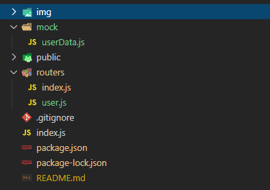
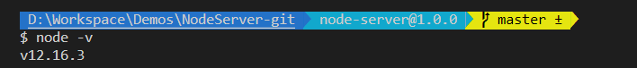
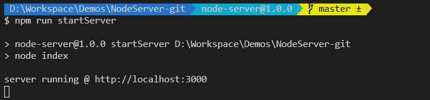
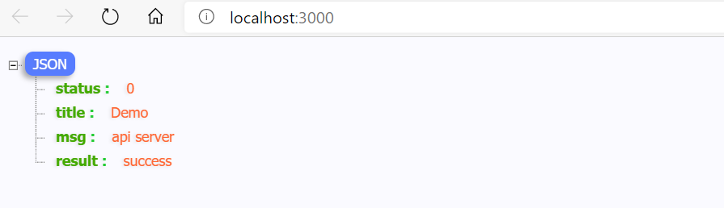
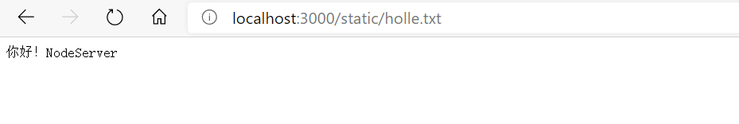

# NodeServer

### Node: 最简单的node server
#### 项目结构
  <br />

文件  <br />
* pubilc
* --holle.txt
* routers
* --index.js
* index.js
* package.json

#### 本地需安装node环境
查看node环境是否已经安装
```
$ node -v 
```
  <br />


### index.js
```
'use strict'
// 引入modules
const express = require("express")
const apicache = require("apicache")
const path = require("path")
const cache = apicache.middleware
// 引入路由
const routes = require('./routers')
//实例化
const app = express() 

// 跨域设置
app.all("*", function (req, res, next) {
  if (req.path !== "/" && !req.path.includes(".")) {
    res.header("Access-Control-Allow-Credentials", true)
    // 这里获取 origin 请求头 而不是用 *
    res.header("Access-Control-Allow-Origin", req.headers["origin"] || "*")
    res.header("Access-Control-Allow-Headers", "X-Requested-With")
    res.header("Access-Control-Allow-Methods", "PUT,POST,GET,DELETE,OPTIONS")
    res.header("Content-Type", "application/json;charset=utf-8")
  }
  next()
})

//
const onlyStatus200 = (req, res) => res.statusCode === 200
//API缓存中间件
app.use(cache("2 minutes", onlyStatus200))
//静态目录
app.use('/static', express.static(path.resolve(__dirname, "public")))

//注册路由配置
app.use(routes)

//启动监听端口
const port = 3000;
app.listen(port, () => {
  console.log(`server running @ http://localhost:${port}`)
})
```
### routers/index.js
路由配置
```
// 引入modules
const express = require('express')
//
const router = express.Router()
//
router.get('/', (req, res, next) => {
  res.json({
    status: '0',
    title: 'Demo',
    msg: 'api server',
    result: 'success'
  })
})
//
module.exports =router;
```

### package.json
可以参考配置scripts
```
{
  "name": "node-server",
  "version": "1.0.0",
  "description": "This is a simple Node (Mock API) server",
  "main": "index.js",
  "scripts": {
    "startServer": "node index",
    "test": "echo \"Error: no test specified\" && exit 1"
  },
  "repository": {
    "type": "git",
    "url": "https://github.com/Poorboy007/NodeServer"
  },
  "keywords": [
    "node",
    "mock",
    "node-api",
    "node-server",
    "NodeServer"
  ],
  "author": "LiuFch <332197723@qq.com>",
  "license": "ISC",
  "dependencies": {
    "apicache": "^1.5.3",
    "express": "^4.17.1"
  }
}

```

如果不想增加更多配置, 可以命令行 node index 不用配置package.json

#### 启动
```
$ npm run startServer //启动server
```
  <br />
浏览器直接访问 http://localhost:3000 可以直接看到response返回数据  <br /><br />
  <br />

### 静态访问

* http://localhost:3000/static/holle.txt

  <br />